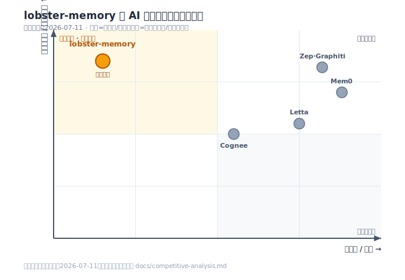

# lobster-memory — Long-term Graph Memory for AI Agents

让 AI 助手拥有基于知识图谱的长期记忆系统。支持自动抽取对话关键点、多维度情感反馈、按需主动回忆、信号驱动的记忆巩固与社群合并。

**技术底座**: [axolotl](https://github.com/LittleLollipop/axolotl) — Rust + PyO3 图数据库,AXEB 持久化 + WAL 恢复。

## 与主流方案对比

> 横向对比 Mem0 / Zep·Graphiti / Letta 等主流长期记忆方案（分析时间：**2026-07-11**）。完整分析见 [docs/competitive-analysis.md](docs/competitive-analysis.md)。

| 能力 | Mem0 | Zep·Graphiti | Letta | **lobster-memory** |
|---|:---:|:---:|:---:|:---:|
| 存储模型 | vector+graph+KV | 时态知识图 | 分层 block | **图 + 情绪 valence** |
| 因果关系边（caused/derived） | ❌ | ❌ | ❌ | ✅ |
| 情绪 / valence 建模 | ❌ | ❌ | ❌ | ✅ |
| 可观察 + 可核对的遗忘 | TTL 衰减 | 时态失效 | 摘要下沉 | ✅ **门控 + 五信号选择性剪枝** |
| 递归自成长抽取（套娃） | ❌ | ❌ | ❌ | ✅ |
| 图内自带「如何维护图」的指令 | ❌ | ❌ | ❌ | ✅ |
| 全明文可观察（反黑盒） | 部分 | 部分 | 中 | ✅ |

**四条别人没有的线**：① 抽取动作会读记忆 → 记忆越厚抽取越准（自成长闭环）；② 偏好/批评以情绪 valence 边落图；③ 遗忘是可查门控 + 选择性剪枝，不是静默衰减；④ 存因果不只存关联。

> 诚实定位：**设计理念在第一梯队，工程成熟度还在早期**——尚缺时态版本化、未跑公开基准、单人维护。想秀的是脑子，不是 star 数。详见完整分析。



## 快速开始

```bash
# 安装
./install.sh

# 测试
python -c "from lobster_memory import MemorySession; print('OK')"
```

## 三行接入

```python
from lobster_memory import MemorySession

session = MemorySession("memory.axeb", consolidate_every=30)

# 会话开始 → 注入记忆上下文
ctx = session.start()              # → system prompt 扩展

# 每轮对话后 → 抽取 + 写入
prompt  = session.build_extraction_prompt(user_msg, reply)
result  = agent.call_llm(prompt)   # 复用龙虾自身模型
session.after_turn(result)

# 定期巩固 → 学习发生在此
if session.should_consolidate(n):
    report = session.consolidate()
```

## 三条独立河流

| 路径 | 做什么 | 何时 |
|---|---|---|
| **写记忆** | 抽取实体/关系/反馈(表扬/批评)写图 | 每轮对话后 |
| **回忆** | 按需主动查询相关记忆 | 龙虾自主判断 |
| **巩固** | 5 信号评分 → 留/剪/合并社群 | 每 K 轮/容量超限 |

## 核心设计

- **单一数据源**: 所有记忆只存 axolotl `.axeb`,无并行 metadata 侧表
- **学习 = 修剪图**: valence + frequency + recency + access + centrality 五信号驱动差异化遗忘
- **软删除回收站**: 低质记忆不解构拓扑,`trashed` 可恢复
- **社群合并**: 自然群落的记忆塌缩为摘要节点(抽象式学习)
- **可分发**: skill 文件夹 + 预编译 wheel / maturin 源码构建

## 文件结构

```
lobster-memory/
├── SKILL.md              # Skill 描述与使用指南
├── install.sh            # 一键安装
├── engine/
│   ├── integration.py    # MemorySession 接入层(从这里开始)
│   ├── base.py           # LobsterMemory 底层 API
│   ├── memory_graph.py   # axolotl 封装(CRUD/PageRank/BFS)
│   ├── extractor.py      # 抽取 prompt + 校验 + 去重
│   ├── recall.py         # 回忆接口 + 访问日志
│   ├── consolidator.py   # 巩固引擎(6 步流水线)
│   └── schema.py         # 常量/枚举/容量参数
└── docs/
    ├── design.md         # v3 详细设计方案
    ├── plan.md           # 原始方案文档
    ├── competitive-analysis.md  # 竞品对比分析
    └── positioning-map.svg      # README 对比区块用的定位图
```

## 依赖

- Python 3.10+
- [axolotl_rs](https://github.com/LittleLollipop/axolotl) (通过 install.sh 自动构建)
- Rust 工具链 (源码构建时;wheel 安装无需)
